# FOR DEVELOPERS

## 実装仕様・コーディングスタイル

- [命名規則・docstring の書き方](under_construction.md)
- [テストコードに関して](under_construction.md)
- [データセットローダの仕様](dataset_loader.md)

## リファレンス

リファレンスはいくつかのパッケージを利用してビルドされいます．リファレンスの修正を行いたい場合は[リファレンスの修正方法](mod_refs.md)を参考にして修正を行ってください．

## モジュール間の依存関係

sensorutils内のモジュールの現在の依存関係は下図の通りです．

