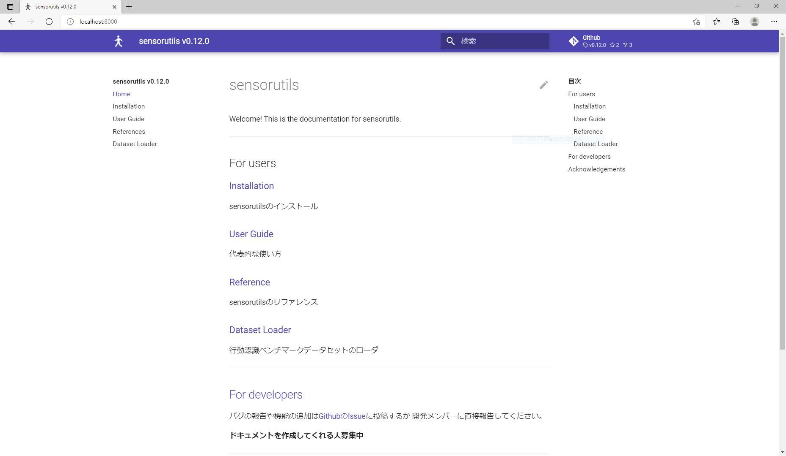

# リファレンスの修正方法

sensorutilsのリファレンスサイトはMkDocsでMarkdownをビルドして作成されています．リファレンスの修正は以下の内容を理解したうえで行ってください．

また，リファレンスを修正する場合はリポジトリをForkし，Forkされたリポジトリ上で修正作業を行ってください．

## 環境

リファレンスのビルドに必要なパッケージは以下の通りです．

- mkdocs==1.2.1
- mkdocs-material==7.1.7
- python-markdown-math==0.8
- mkdocstrings==0.15.2
- pytkdocs[numpy-style]==0.11.1

```sh
$ pip install mkdocs==1.2.1 mkdocs-material==7.1.7 python-markdown-math==0.8 mkdocstrings==0.15.2

$ pip install pytkdocs[numpy-style]==0.11.1
```

mkdocs-materialはmkdocsのページレイアウト用のパッケージで，python-markdown-mathはMarkdown上のLatexコードを扱うためのライブラリです．

mkdocstringsはpythonコード内のdocstringをパースして自動でリファレンスを作成するパッケージです．pytkdocsはmkdocstringsの依存パッケージとしてインストールされますが，sensorutilsではnumpyスタイルのdocstringを採用しているため，numpyスタイルに対応したpytkdocsを手動でインストールする必要があります．

各種パッケージの詳細な使い方は公式のリファレンスを参照してください．

- [MkDocs](https://www.mkdocs.org/getting-started/#getting-started-with-mkdocs)
- [Material for MkDocs](https://squidfunk.github.io/mkdocs-material/getting-started/)
- [mkdocstrings](https://mkdocstrings.github.io/usage/)

## 関連ファイルの場所

リファレンスを構成する主要なファイルは`docs/mkdocs/`下にあります．

!!! Warning
    `docs/site/`下に格納されているファイルを手動で書き換えないでください．ここにはmkdocsによってビルドされたファイルが格納されており，`mkdocs build`によって変更されることを想定しています．

```
docs/mkdocs + dev
            + javascripts         : jsファイル
            + refs                : sensorutilsで提供される関数等の説明を記述したMarkdownファイル
            + site                : ビルドされた静的サイト(これが公開される)
            + favicon.ico         : favicon
            + favicon.png         : サイトのロゴ
            + mkdocs.yml          : サイトをビルドする際のmkdocsの設定ファイル
            + index.md            : サイトトップ
            + install.md          : インストール方法
            + install_prev_ver.md : 過去のバージョンのまとめ
            + guide.md            : sensorutilsの基本的な使い方
            + refs.md             : sensorutilsに含まれる関数等のリファレンスのトップ
```

## サイトのデバッグとビルド

### デバッグ

`docs/mkdocs/`下で`mkdocs serve`とするとローカル上にサーバを立てることができ，ブラウザでビルド結果を確認しながらリファレンスを修正することが可能です．

```sh
$ cd docs/mkdocs/

$ mkdocs serve
INFO     -  Building documentation...

...

INFO     -  Documentation built in 1.34 seconds
INFO     -  [12:41:08] Serving on http://127.0.0.1:8000/
INFO     -  [12:41:10] Browser connected: http://localhost:8000/dev/mod_refs.html
```



### ビルド

リファレンスの修正が完了したら，`mkdocs build`でサイトをビルドすることを忘れないようにしてください．`mkdocs serve`はビルド結果を見ることができるだけで，ビルド結果は保存されません．

## サイトを修正する

対応するMarkdownを書き換えることでサイトを修正することができます．サイトを修正する際は必ずMkDocsやMaterial for MkDocsに準じてファイル等の修正を行うようにしてください．


## 関数等の説明を修正する

関数等の説明はsensorutilsの実装コード内のdocstringをから自動生成しています．従って，実装コード内のdocstringsを変更することでサイト上のリファレンスを変更することが可能です．

!!! Warning
    実装コードのdocstringsを修正する際はdocstrings以外の箇所を変更しないでください．もし実装コード内に問題点を見つけた場合は[こちら](https://github.com/haselab-dev/sensorutils/blob/develop/.github/CONTRIBUTING.md)を参考にしてIssueで問題点の報告を行いそちらで対処するようにしてください．

## 修正を提案する

リファレンス修正の提案は[こちら](https://github.com/haselab-dev/sensorutils/blob/develop/.github/CONTRIBUTING.md#機能の追加)の"機能の追加"を参考にIssueやPull Requestから行ってください．